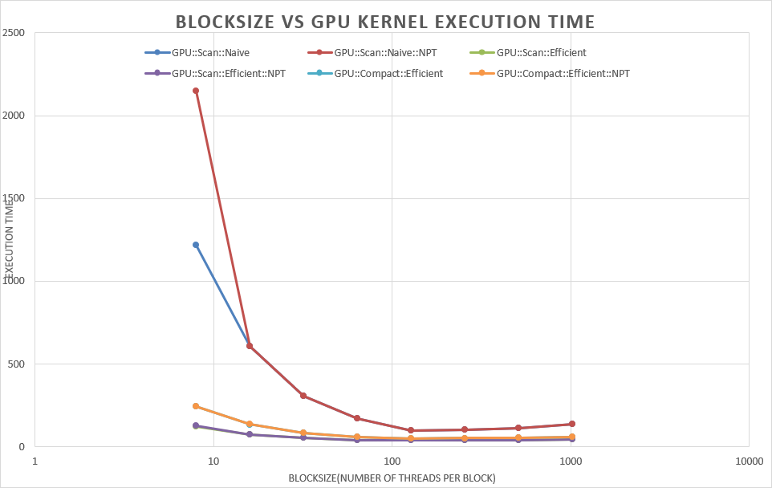
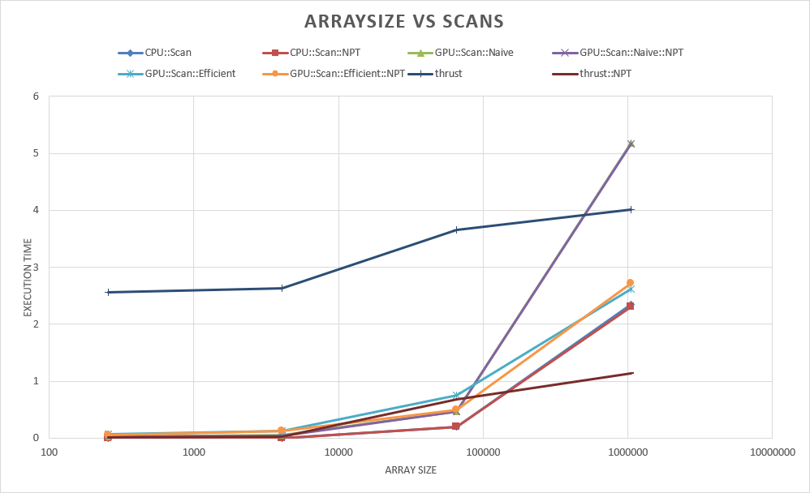
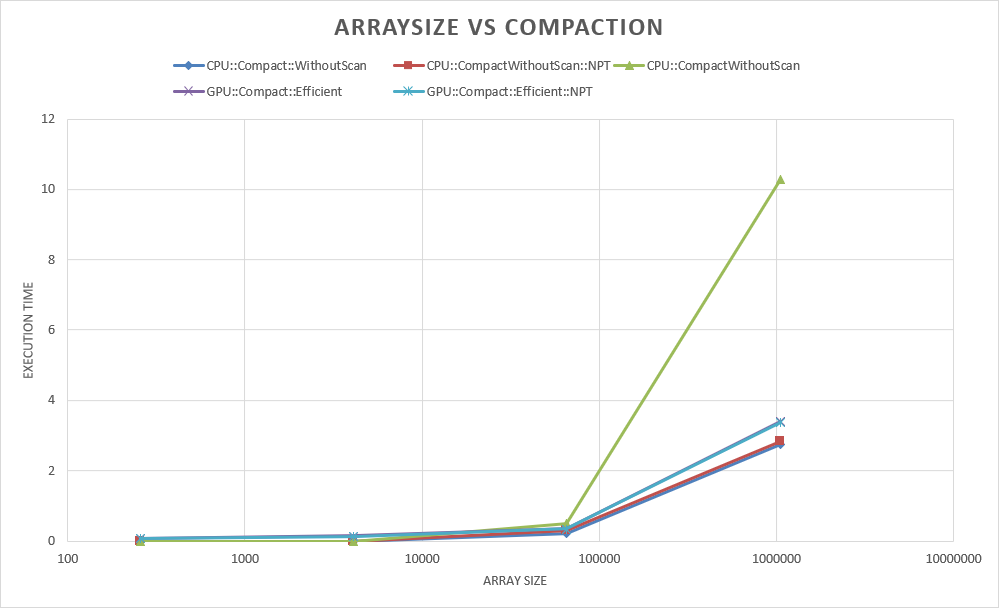
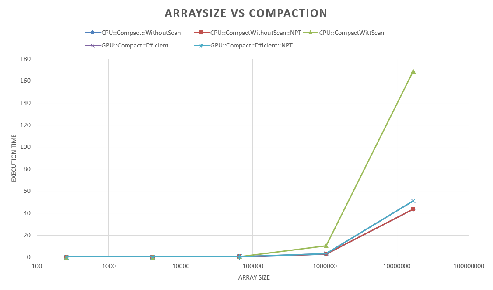

CUDA Stream Compaction
======================

**University of Pennsylvania, CIS 565: GPU Programming and Architecture, Project 2**

* Jizhou Yan
* Tested on: Windows 10, i7-4789K @ 4.00GHz 32GB, GTX 1080Ti(Personal Desktop)

## Features
* Scan
  * CPU Scan
  * GPU Naive Scan
  * GPU Work efficient Scan
* Compaction
  * CPU Compaction with/without Scan
  * GPU Work efficient Compaction
* GPU Radix Sort

## Questions

* Roughly optimize the block sizes of each of your implementations for minimal run time on your GPU.

	

	From above chart, for each implementation, the optimized block_size is around 128. Small block size (less than 16) will cause serious performance penalties. When block size is higher than 128, performance cannot continue obtaining any improvement whith the increase of block size, and performance will drop off for large block size.

* Compare all of these GPU Scan implementations (Naive, Work-Efficient, and Thrust) to the serial CPU version of Scan. Plot a graph of the comparison (with array size on the independent axis).

	

	An unexpected thing about the above images are thrust(the blue line in the middle of the image) taking much more time when it's first time running. I guess that's because the implementation of THRUST, it might require some initialization operations during the first time running. And once after that, the thrust execution time become much faster than my implementation.

	With the increase of array size, thrust achives the slowest increase of execution time. CPU and GPU implementations' performance will suffer from the increase of array size. 

	In my computer, GPU implementation is slower than CPU impelmentation. Work-efficient GPU implemenetation is much faster than naive GPU scan.

	Non-power-of-two array size will introduce some decrease of performance for GPU implementation, but very slightly.

	

	Non-power-of-tow array size have trivial influence on both gpu and cpu.

	GPU implementation is slower than cpu without scan implementation, but much faster than cpu implementation with scan.

	

	For extra, I implementated Radix Sort, compared with std::sort, radix sort is generally slower than std::sort.

	Execution time increases almost linearly for Radix Sort.

* Can you find the performance bottlenecks? Is it memory I/O? Computation? Is it different for each implementation?

	I think the bottleneck is memory I/O. Without using shared-memory, it's very inefficient for adjacent threads accessing memory with huge physical distance. Especially when this project is all about memory I/O. Even using work-efficient scan implementation, GPU still cannot beat CPU implemetation. For GPU scan and compaction implementations, array size of power of two can obtain better performance than non-power-of-two array size. On CPU, non-power-of-tow doesn't seem to have huge influence. For this type of memory I/O-intensive computation tasks, we need some better solution about CUDA to improve the efficience of memory IO.

## Build
Modified `CMakeLists.txt` for adding new files `radixsort.h` and `radixsort.cu`. 

## Example Output
Copy and paste from one execution:

```

**********************
**  TEST PARAMETERS **
**********************
        Array size = 1048576
        BlockSize  = 128


****************
** SCAN TESTS **
****************
    [   0   1  40  32  27  35  15  21  46  15   4  37  32 ...  43   0 ]
==== cpu scan, power-of-two ====
<==TIMER==> Scan::CPU =  4.470 ms <==TIMER==>
    [   0   0   1  41  73 100 135 150 171 217 232 236 273 ... 25689112 25689155 ]

==== cpu scan, non-power-of-two ====
<==TIMER==> Scan::CPU =  4.626 ms <==TIMER==>
    [   0   0   1  41  73 100 135 150 171 217 232 236 273 ... 25689004 25689051 ]
    passed

==== naive scan, power-of-two ====
<==TIMER==> Scan::GPU::Naive =  0.692 ms <==TIMER==>
    passed

==== naive scan, non-power-of-two ====
<==TIMER==> Scan::GPU::Naive =  0.682 ms <==TIMER==>
    passed

==== work-efficient scan, power-of-two ====
<==TIMER==> Scan::GPU::Efficient =  0.570 ms <==TIMER==>
    passed

==== work-efficient scan, non-power-of-two ====
<==TIMER==> Scan::GPU::Efficient =  0.465 ms <==TIMER==>
    passed

==== thrust scan, power-of-two ====
<==TIMER==> Scan::Thrust =  0.298 ms <==TIMER==>
    passed

==== thrust scan, non-power-of-two ====
<==TIMER==> Scan::Thrust =  0.295 ms <==TIMER==>
    passed


*****************************
** STREAM COMPACTION TESTS **
*****************************
    [   2   1   2   2   3   3   1   3   2   1   0   1   2 ...   3   0 ]
==== cpu compact without scan, power-of-two ====
<==TIMER==> Compact::CPU::WithoutScan =  2.142 ms <==TIMER==>
    [   2   1   2   2   3   3   1   3   2   1   1   2   2 ...   1   3 ]
    passed

==== cpu compact without scan, non-power-of-two ====
<==TIMER==> Compact::CPU::WithoutScan =  2.157 ms <==TIMER==>
    [   2   1   2   2   3   3   1   3   2   1   1   2   2 ...   3   2 ]
    passed

==== cpu compact with scan ====
<==TIMER==> Compact::CPU::WithScan =  9.619 ms <==TIMER==>
    [   2   1   2   2   3   3   1   3   2   1   1   2   2 ...   1   3 ]
    passed

==== work-efficient compact, power-of-two ====
<==TIMER==> Compact::GPU::Efficient =  0.609 ms <==TIMER==>
    passed

==== work-efficient compact, non-power-of-two ====
<==TIMER==> Compact::GPU::Efficient =  0.829 ms <==TIMER==>
    passed


*****************************
****** RADIX SORT TESTS *****
*****************************
    [ 17550 26101 5590 26082 17127 16335 23265 11071 4246 27565 19904 20337 3282 ... 27543 10273 ]
==== std::sort ====
<==TIMER==> CPU::std::sort =  56.527 ms <==TIMER==>
    [   0   0   0   0   0   0   0   0   0   0   0   0   0 ... 32767 32767 ]

==== GPU::RadixSort ====
<==TIMER==> GPU::Radix Sort =  18.000 ms <==TIMER==>
    passed

```
